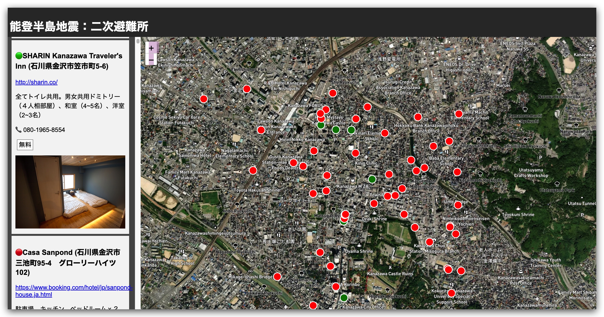
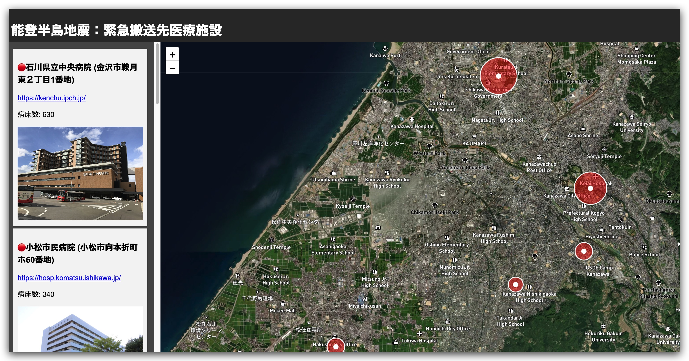
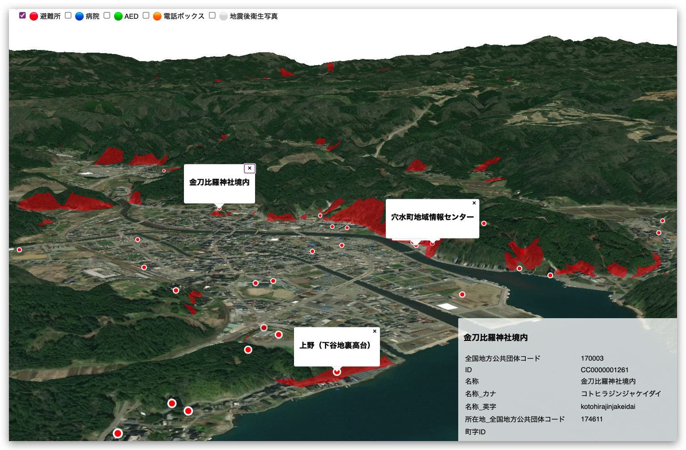
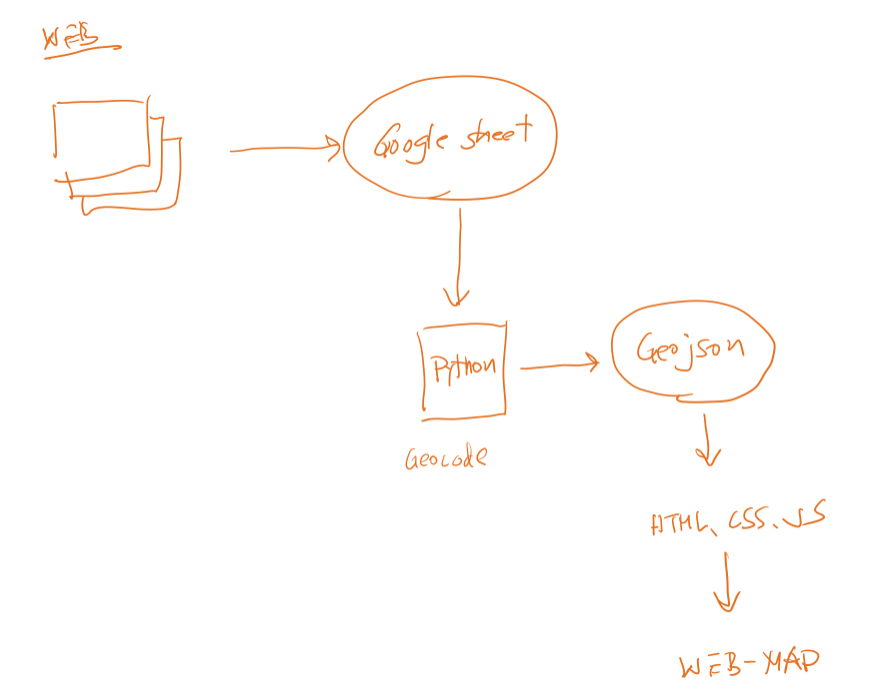
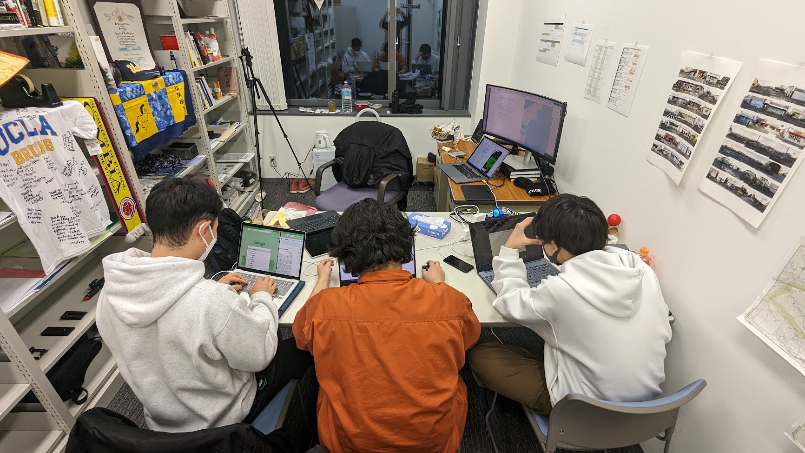
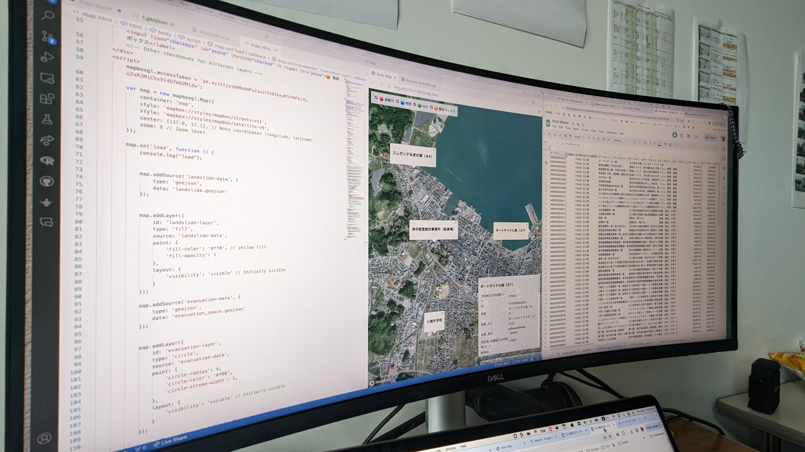
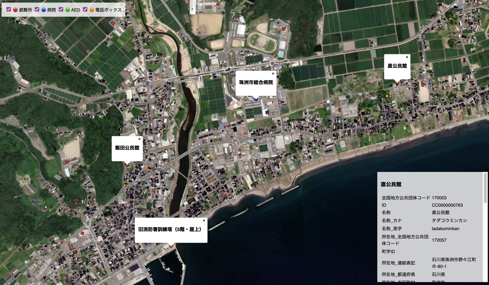

# Building a crisis map of the Noto Earthquake 

[マップリンク: https://yohman.github.io/noto/map.html](https://yohman.github.io/noto/map.html)

## Log

### January 17, 2024

- added hotels offering free accommodations for survivors

[https://yohman.github.io/noto/hotel.html](https://yohman.github.io/noto/hotel.html)

### January 16, 2024

- added supporting hospitals and their capacities

[https://yohman.github.io/noto/hospital.html](https://yohman.github.io/noto/hospital.html)

### January 12, 2024

- added zones susceptible to landslides
- added 3D mapping to allow for terrain visualizations 

### January 10, 2024

Students at Reitaku University are building a crisis map for the Noto Earthquake. Using a simple model, each student volunteers to "find" data relevant to the crisis, downloads, exlores, conducts geoprocessing in Python, and ultimately converts the data into a web-friendly geojson format. A customized web front end is built using MapboxGL's javascript API to visualize the cleaned up data and posted on GitHub pages for the public. 

*Figure 1: Data exploration and geoprocessing*

*Figure 2: Reitaku University students working on the crisis map*

*Figure 3: Data, programming, and visualization*

*Figure 4: Web front end of the crisis map*
